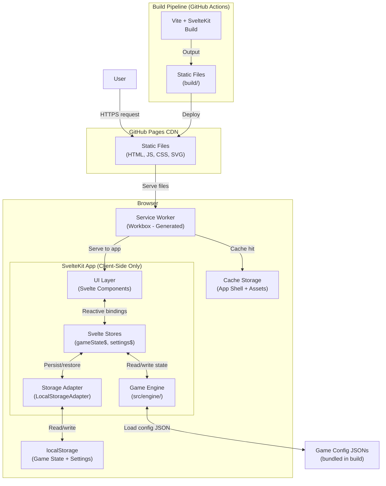
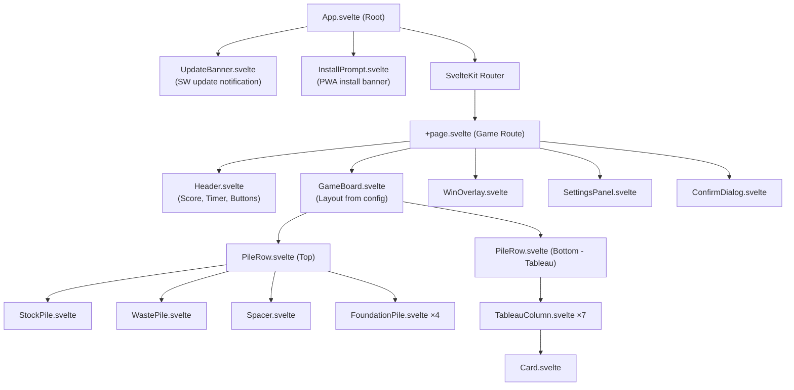
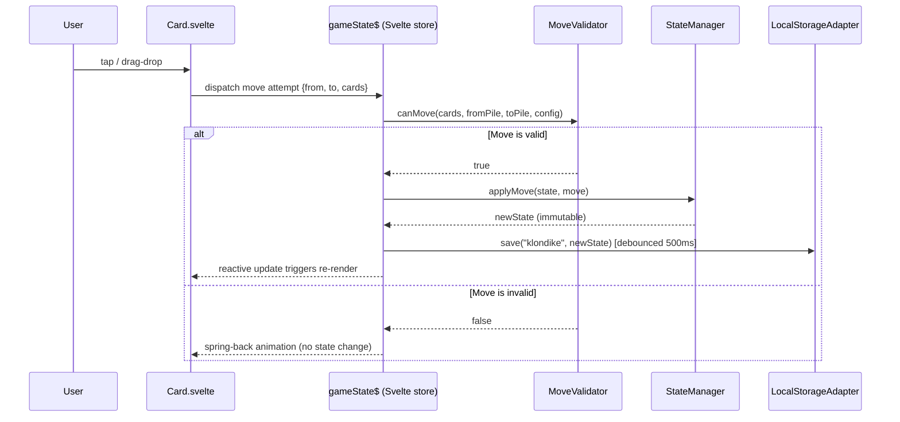
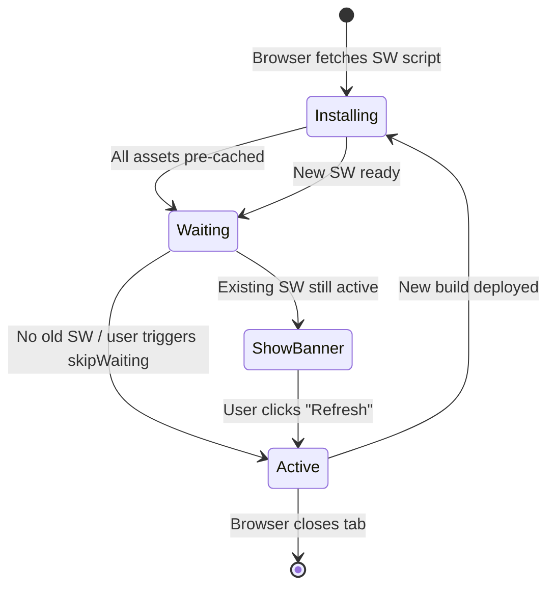
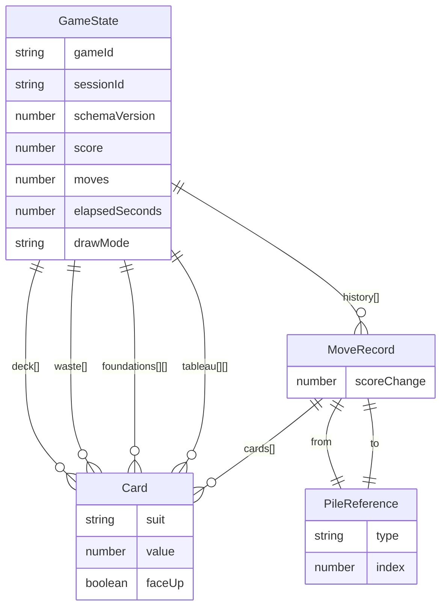

# System Architecture
**Project:** Svelte-Solitaire PWA  
**Author:** Architect Agent  
**Date:** 2026-05-04  
**Version:** 1.0

---

## 1. High-Level Architecture



---

## 2. Component Tree



---

## 3. Game Engine Data Flow



---

## 4. Service Worker Lifecycle



---

## 5. Project Directory Structure

```
solataire-game-app/
├── .github/
│   └── workflows/
│       └── deploy.yml
├── .copilot/                        ← Agent definitions
├── docs/
│   ├── PRD.md
│   ├── requirements/
│   ├── architecture/                ← ADRs + this file
│   ├── schema/
│   └── project-management/
├── src/
│   ├── app.html                     ← SvelteKit HTML template
│   ├── app.css                      ← Global CSS variables / reset
│   ├── routes/
│   │   ├── +layout.svelte           ← Root layout (SW registration)
│   │   └── +page.svelte             ← Main game page
│   ├── lib/
│   │   └── index.ts                 ← Re-exports for $lib alias
│   ├── engine/
│   │   ├── GameEngine.ts
│   │   ├── DeckFactory.ts
│   │   ├── MoveValidator.ts
│   │   ├── StateManager.ts
│   │   ├── WinDetector.ts
│   │   ├── AssetManager.ts
│   │   └── strategies/
│   │       ├── BuildRuleStrategy.ts
│   │       ├── registry.ts
│   │       ├── AscendingSameSuitStrategy.ts
│   │       ├── DescendingAlternatingColorStrategy.ts
│   │       ├── DescendingSameSuitStrategy.ts
│   │       ├── AnyStrategy.ts
│   │       └── NoneStrategy.ts
│   ├── storage/
│   │   ├── StorageAdapter.ts        ← Interface
│   │   └── LocalStorageAdapter.ts
│   ├── stores/
│   │   ├── gameState.ts             ← writable<GameState>
│   │   └── settings.ts              ← writable<Settings>
│   ├── components/
│   │   ├── GameBoard.svelte
│   │   ├── PileRow.svelte
│   │   ├── TableauColumn.svelte
│   │   ├── Card.svelte
│   │   ├── StockPile.svelte
│   │   ├── WastePile.svelte
│   │   ├── FoundationPile.svelte
│   │   ├── Header.svelte
│   │   ├── WinOverlay.svelte
│   │   ├── SettingsPanel.svelte
│   │   ├── ConfirmDialog.svelte
│   │   ├── InstallPrompt.svelte
│   │   └── UpdateBanner.svelte
│   ├── games/
│   │   └── klondike/
│   │       └── config.json
│   └── assets/
│       ├── suits/
│       │   ├── hearts.svg
│       │   ├── diamonds.svg
│       │   ├── clubs.svg
│       │   └── spades.svg
│       └── card-backs/
│           ├── classic-blue.svg
│           └── classic-red.svg
├── static/
│   ├── .nojekyll
│   ├── manifest.json
│   ├── icons/
│   └── screenshots/
├── tests/
│   ├── plans/
│   ├── unit/
│   └── e2e/
├── svelte.config.js
├── vite.config.ts
├── tsconfig.json
├── package.json
└── workflow-token.json
```

---

## 6. State Data Model



---

## 7. Security Architecture

| Surface | Threat | Control |
|---|---|---|
| localStorage deserialization | Stale/malformed JSON causing crash | `try/catch` + schema version check; discard on mismatch |
| JSON config loading | Malicious bundled config | Configs are static build-time assets; no runtime URL fetch |
| SVG asset loading | SVG XSS (injected scripts in SVG) | All SVGs are bundled at build time; CSP blocks inline scripts |
| Service Worker scope | Intercepting unintended origins | SW scope locked to `/solataire-game-app/` |
| Dependency supply chain | Malicious npm package | `npm ci` with lockfile; `npm audit` in CI pipeline |
| User input (card moves) | N/A (no text input surfaces) | No SQL/XSS injection risk from card game interactions |
